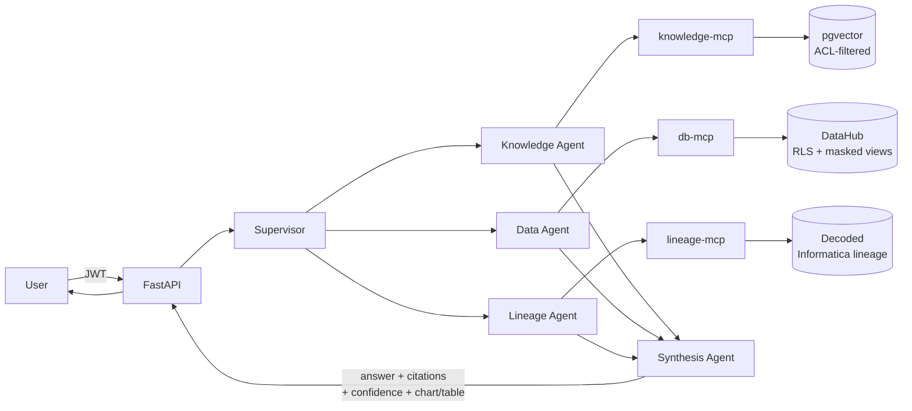

# Enterprise RAG + MCP Agents

Production-shaped reference implementation of a **multi-agent RAG platform
over bank databases, SharePoint, and decoded Informatica PowerCenter ETL
lineage** — built around the [Model Context Protocol](https://modelcontextprotocol.io)
as a *controlled capability interface*, not a shortcut to give an LLM raw
SQL or HTTP access.

Open-source-heavy stack: **LangChain/LangGraph** for orchestration,
**PostgreSQL + pgvector** (with **ChromaDB** as a swappable alternate
backend) for embeddings/vector search, **FastAPI** + **JWT/OAuth2** for
serving, and a **React** chat UI that renders citations, tables, *and*
charts for database-backed answers.

> If you only read one design decision before diving in: **every MCP tool
> here is a narrow, typed operation** (`get_metric`, `search_policy`,
> `get_transform_rule`, ...) — there is no `execute_sql(sql)` or
> `http_get(url)` anywhere in this codebase, and a test
> (`tests/test_mcp_tool_schemas.py`) enforces that at the source level.

> **Also in this repo:** [`gym-coach/`](gym-coach/README.md) is a free, open-source AI gym coach for iPhone. It builds an adaptive 12-week plan and installs without the App Store.

## What's in here

| Capability | Where |
|---|---|
| JWT/OAuth2 auth, RBAC roles, fine-grained `security_groups` entitlements, refresh-token revocation | `backend/app/auth/` |
| Redis-backed conversation memory (hot cache + durable Postgres fallback), rate limiting | `backend/app/memory/` |
| Model gateway: Anthropic / OpenAI / Ollama, automatic fallback, PII/secret guardrails, per-day token budget | `backend/app/gateway/` |
| RAG over SharePoint docs: chunk → embed → pgvector/Chroma → **hard ACL gate** on retrieval | `backend/app/rag/` |
| Informatica PowerCenter XML decoding → persisted, queryable field-level lineage graph | `backend/app/informatica/` |
| 4 MCP servers (`knowledge-mcp`, `db-mcp`, `lineage-mcp`, `governance-mcp`): typed tools, service-auth, per-call audit, timeouts | `backend/app/mcp_servers/` |
| Supervisor/router + specialist agents on LangGraph — deterministic routing, never one giant agent | `backend/app/agents/` |
| Row-level security + column masking on the DataHub warehouse (Postgres RLS as an Oracle VPD/Data Redaction analog) | `sample_data/db_init/`, [`docs/oracle_datahub_security.md`](docs/oracle_datahub_security.md) |
| Chart + table generation for DB-backed answers (stat tiles, comparison bars, time series) | `backend/app/analytics/chart_builder.py` |
| Golden-dataset evaluation gate: routing accuracy, groundedness, **authorization correctness** | `backend/app/evaluation/` |
| React chat UI: login, streaming-feel chat, citations, tables, charts, conversation history | `frontend/` |
| Full audit trail: one row per MCP tool call / retrieval / auth decision, correlated end-to-end | `backend/app/audit/` |

## Architecture



Full diagrams (trust boundaries, request sequence, RAG pipeline, lineage
decoding pipeline, deployment topology) are in
[`docs/architecture.md`](docs/architecture.md).

## Quickstart

```bash
git clone <this-repo-url> && cd McpAgentRAG
cp .env.example .env   # fill in secrets — see docs/setup.md
make up                # builds + starts postgres, redis, 4 MCP servers, backend, frontend
make seed               # demo users + sample SharePoint docs + sample Informatica lineage
```

Open **http://localhost:5173** and log in as `analyst.northeast@bank.example`
/ `AnalystPass123!` (see [`docs/setup.md`](docs/setup.md) for all demo
accounts and their entitlements). API docs at **http://localhost:8000/docs**.

Full step-by-step instructions, troubleshooting, running fully offline
(no API key, via Ollama), and switching the vector store backend:
**[`docs/setup.md`](docs/setup.md)**.

## Try asking

- *"What is our data access policy for customer PII?"* → Knowledge Agent, cites the policy doc.
- *"What was total_deposits for 2026-06?"* → Data Agent, stat tile + table, cites the certified metric.
- *"Plot the delinquency rate trend"* → Data Agent, line chart.
- *"Where does account_balance come from in M_LOAD_ACCOUNTS?"* → Lineage Agent traces the decoded field-level lineage back to the source.
- Log in as `analyst.limited@bank.example` (zero entitlements) and ask the deposits question again → a clear, correctly-enforced denial instead of a plausible-looking wrong number.

## Security model, in one table

| Boundary | Rule | Enforced in |
|---|---|---|
| User → API | JWT/OAuth2, scope/role validation, request size limits | `app/auth/`, `app/main.py` |
| API → Agents | Only agent capabilities the user's role is entitled to | `app/auth/rbac.py` |
| Agent → MCP | Allowlisted, typed tools only; typed inputs; timeouts; no free-form SQL/HTTP | `app/mcp_servers/*/server.py` |
| MCP → Data | Read-only service identity; row/column policy enforced **server-side** | `app/mcp_servers/db_mcp/oracle_adapter.py`, `app/rag/retrieval.py` |
| RAG → LLM | Only ACL-filtered, retrieved evidence enters the prompt, wrapped as untrusted data | `app/gateway/guardrails.py` |
| LLM → User | No invented facts; every claim carries a citation | `app/agents/synthesis_agent.py` |

Deep dive on how the row-level-security / PII-masking model here maps onto
a real Oracle-backed DataHub (VPD, Data Redaction, RAS):
**[`docs/oracle_datahub_security.md`](docs/oracle_datahub_security.md)**.

## Tech stack

- **Orchestration**: LangGraph (deterministic state machine), LangChain core/text-splitters
- **Vector search**: pgvector (default) or ChromaDB, `sentence-transformers` (`bge-small-en-v1.5`) for local embeddings
- **MCP**: official `mcp` Python SDK, streamable-HTTP transport, 4 independent servers
- **Backend**: FastAPI, SQLAlchemy 2.0 (async), Alembic, Postgres, Redis, structlog
- **Model providers**: Anthropic (default), OpenAI, Ollama (fully local fallback) — behind one gateway
- **Frontend**: React 18 + TypeScript + Vite, Zustand for state, Recharts for charts
- **Infra**: Docker Compose (single backend image reused for API + all 4 MCP servers)

## Repository structure

See [`docs/setup.md`](docs/setup.md#repository-layout) for the annotated
tree.

## Testing & evaluation

```bash
make test       # pytest: auth, ACL-filtering, Informatica parser/lineage-graph,
                 # MCP tool-schema governance, supervisor routing
make evaluate    # golden-dataset quality gate — routing accuracy, groundedness,
                 # and (weighted hardest) authorization correctness
```

The evaluation gate deliberately treats a wrongly-*allowed* answer as a
harder failure than a wrongly-*refused* one — a fluent, well-cited answer
that leaked unauthorized data is worse than a visibly incomplete one.

## Known limitations / roadmap

This is a reference implementation sized for a portfolio/interview
project, not a live production deployment. Explicitly out of scope /
simplified on purpose:

- **Postgres stands in for Oracle.** The security *model* (RLS, masked
  views, read-only service identity) is a deliberate analog — see
  `docs/oracle_datahub_security.md` for exactly what changes to point this
  at real Oracle.
- **No IaC for Azure.** Deployment here is Docker Compose; the original
  engagement ran on Azure (AKS/Container Apps, Key Vault, Managed
  Identity) — that mapping is documented but not scripted as Terraform/Bicep.
- **Chat responses are request/response, not streamed token-by-token.**
  SSE/WebSocket streaming would be the natural next step for perceived
  latency.
- **The evaluator runs in-process**, not yet wired into a CI pipeline
  against a staging deployment.

## License

MIT — see [`LICENSE`](LICENSE).
