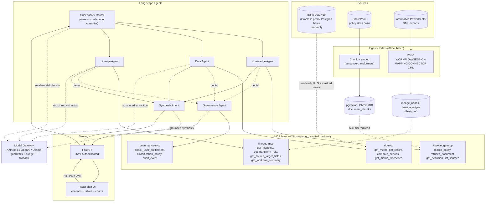
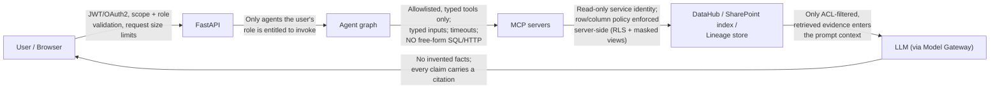
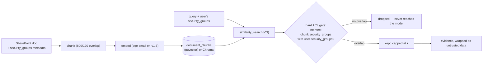
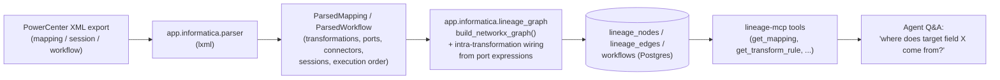
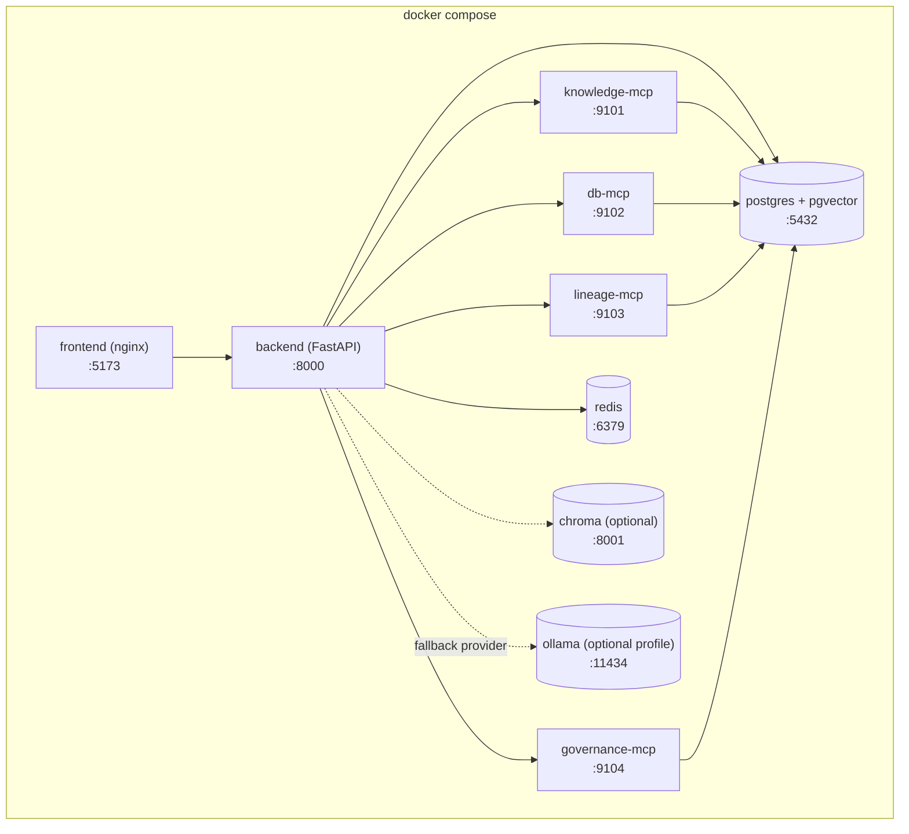

# Architecture

This document is the detailed companion to the [README](../README.md)'s
architecture summary. All diagrams are Mermaid and render natively on
GitHub — no extra tooling needed to view them.

## 1. System overview



## 2. Trust boundaries (D3)

Every hop between "outside" and "inside" enforces a specific rule. This is
the fastest way to reason about the system's security posture:



Each arrow above maps directly to a piece of code:

| Boundary | Enforced in |
|---|---|
| User → API | `app/auth/*`, `app/main.py` middleware (CORS, size limit, rate limit) |
| API → Agents | `app/auth/rbac.py` (`AGENT_CAPABILITIES`), checked in `app/agents/supervisor.py` |
| Agent → MCP | `app/mcp_servers/*/server.py` — every tool is `@mcp.tool()` with scalar-typed params only |
| MCP → Data | `app/mcp_servers/db_mcp/oracle_adapter.py` (RLS + masked views), `app/rag/retrieval.py` (ACL hard-filter) |
| RAG → LLM | `app/gateway/guardrails.py::wrap_untrusted_evidence` |
| LLM → User | `app/agents/synthesis_agent.py` (citations required, confidence derived from real signals) |

## 3. Request sequence (a single chat turn)

```mermaid
sequenceDiagram
    participant U as User (browser)
    participant API as FastAPI /api/chat
    participant SUP as Supervisor
    participant DA as Data Agent
    participant MCP as db-mcp
    participant PG as Postgres (RLS + masked views)
    participant GW as Model Gateway
    participant SYN as Synthesis Agent

    U->>API: POST /api/chat {question} + JWT
    API->>API: verify JWT, rate limit, load conversation memory
    API->>SUP: invoke agent graph (question, user, groups)
    SUP->>GW: (if no keyword rule matches) classify intent
    GW-->>SUP: route = "data"
    SUP->>DA: dispatch
    DA->>MCP: list_metrics()
    MCP-->>DA: allowlisted metric catalog
    DA->>GW: extract {metric_name, period} (structured, small model)
    GW-->>DA: {"metric_name": "total_deposits", "period": "2026-06"}
    DA->>MCP: get_metric("total_deposits", "2026-06")
    MCP->>PG: SET app.user_security_groups; SELECT ... FROM v_metric_total_deposits
    PG-->>MCP: value (only if entitlement check passed)
    MCP-->>DA: {value, unit, found}
    DA->>DA: build chart_spec + table_data
    DA-->>SYN: evidence + tool_results
    SYN->>GW: synthesize grounded answer (evidence wrapped as untrusted data)
    GW-->>SYN: answer text
    SYN-->>API: answer + citations + confidence + chart + table
    API-->>U: ChatResponse (persisted to conversations/messages)
```

## 4. RAG indexing + ACL-filtered retrieval (D4)



The gate happens in `app/rag/retrieval.py::retrieve` — strictly after
similarity search, entirely in application code, never delegated to the
model. See `docs/oracle_datahub_security.md` for the equivalent
enforcement on the structured-data side (row/column security in Postgres
RLS / Oracle VPD).

## 5. Informatica decoding pipeline (D7)



The one subtlety worth calling out explicitly (it cost a real bug during
development — see `app/informatica/lineage_graph.py`'s docstring): a
PowerCenter `<CONNECTOR>` only wires a port on one transformation instance
to a port on another. It never describes how a transformation's own input
ports flow into its own output ports — that logic lives implicitly in each
output port's `EXPRESSION` attribute. The lineage graph builder adds those
intra-transformation edges explicitly by matching input port names inside
each output port's expression text; skip that step and every expression
transformation silently truncates the traced lineage by one hop.

## 6. Multi-agent responsibility table (D6)

| Agent | Responsibility | Must not do |
|---|---|---|
| Supervisor | Classify intent (rules → small-model fallback → policy gate), delegate | Directly query arbitrary data |
| Knowledge Agent | SharePoint/wiki retrieval via `knowledge-mcp` | Bypass ACL filtering |
| Data Agent | Certified metrics/records via `db-mcp` only | Invent a metric definition or run raw SQL |
| Lineage Agent | Informatica mapping/workflow decoding Q&A via `lineage-mcp` | Guess a mapping rule it hasn't actually parsed |
| Governance Agent | Explain denials, entitlements, audit narrative events | Grant access itself |
| Synthesis Agent | Combine evidence into one grounded, cited answer | Override authorization or invent facts |

## 7. Deployment topology (docker-compose)



Every backend-family container (`backend`, the four MCP servers, and the
one-shot `migrate` job) is built from the **same image** — only the
`command:` differs — so there is exactly one Dockerfile and one
`requirements.txt` to keep in sync. See `docker-compose.yml`.
